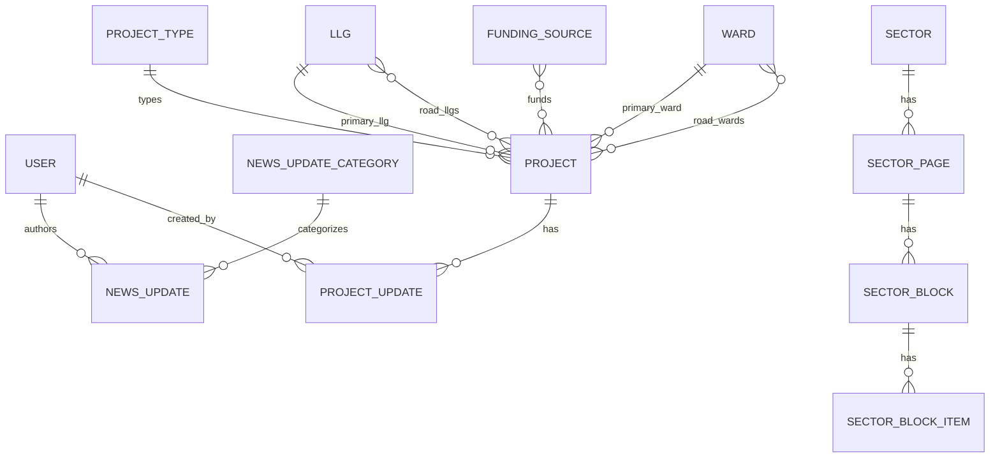

# Domain Model and Data Flow

## Purpose
A compact, code-aligned overview of the system's domain model and the main public/admin flows.

## Core Entities

### Users and Access
- User
- Role (Spatie)
- Permission (Spatie)

### Public Content
- NewsUpdate
- NewsUpdateCategory
- SectorPage
- SectorBlock
- SectorBlockItem

### Projects
- Project
- ProjectUpdate
- ProjectType
- FundingSource

### Geography
- Llg
- Ward

## Relationships (Eloquent)

### Users and Access
- User has many NewsUpdate (authoring)
- User has roles and permissions (Spatie)

### News
- NewsUpdate belongs to NewsUpdateCategory
- NewsUpdate belongs to User
- NewsUpdateCategory has many NewsUpdate

### Projects
- Project belongs to ProjectType
- Project belongs to Llg (primary)
- Project belongs to Ward (primary)
- Project belongs to many FundingSource (pivot: project_funding_source)
- Project belongs to many Llg (pivot: project_llg) for ROAD projects
- Project belongs to many Ward (pivot: project_ward) for ROAD projects
- Project has many ProjectUpdate
- ProjectUpdate belongs to Project
- ProjectUpdate belongs to User (author)

### Sector Pages
- SectorPage belongs to Sector
- SectorPage has many SectorBlock
- SectorBlock has many SectorBlockItem

## Cardinality Diagram (Mermaid)



## Main Flows

### Public Site
- Home page: published news + public projects
- News listing: search + category filter, published only
- News detail: published only, related news from category
- Projects listing: search + status/type filter
- Project detail: full project data + updates
- Sector profile: sector page + all sectors for sidebar
- Contact: email via ContactController (recaptcha outside local)

### Admin (Filament)
- Projects: create/edit with ROAD vs non-ROAD handling
- News: create/edit/publish + media upload
- Geography: LLGs, Wards
- Taxonomy: ProjectType, NewsUpdateCategory, Sector
- Pages: SectorPage, content blocks
- Access: Users, Roles, Permissions

## Notable Data Constraints
- Project has status enum: planned/approved/in_progress/completed/delayed/cancelled
- Project uses public_fields JSON to control field visibility
- ProjectUpdate tracks progress change and current status snapshot
- NewsUpdate uses slug + published flags for visibility

## Known Model/Schema Mismatches (To Reconcile)
- ProjectUpdate model uses `update_text`, migration uses `progress_update`
- Project::publish() writes `published_by` which is not migrated
- ProjectUpdate accessor references `additional_spending` which is not in migration
```
